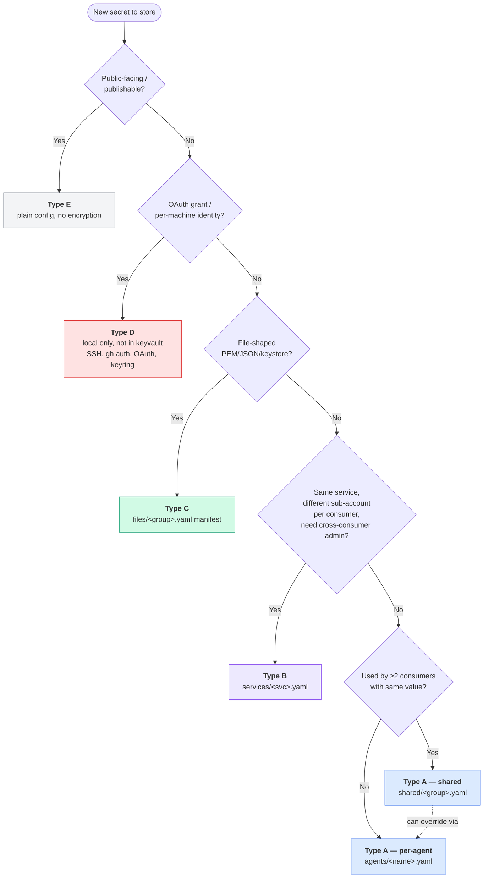
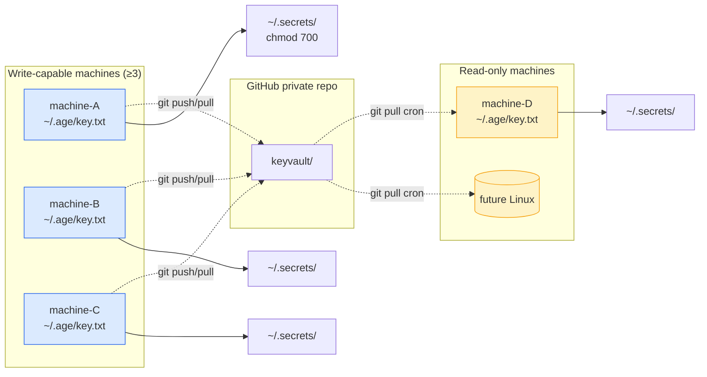

# Spec

> Source of truth = sops-encrypted git repo. Decrypted local cache = `~/.secrets/`.
> 4-Type taxonomy + composition rules + sync orchestration + rotation playbooks.

**Status**: alpha draft, dogfooding stage.

---

## 1. Design goals

| Goal | How we achieve it |
|---|---|
| Single source of truth | One encrypted git repo, all changes via commits |
| Cross-machine sync | sops encryption + git pull + decrypt cron |
| Zero rewrite for consumer code | Decrypted output goes to expected paths (`~/.secrets/<service>/.env`); your existing scripts keep working |
| Low onboarding friction | New machine: `age-keygen` + add pubkey + `git clone` + `sync` |
| Encrypted at rest | sops field-level or whole-file, with age recipients |
| Per-file access control | Each secret file lists which machines can decrypt |
| Audit trail | Git history + optional operation log |
| Tool-agnostic | The spec doesn't hard-depend on any single agent platform |

---

## 2. Secret taxonomy: 4 + 1 types

The core opinion of this project: **classify every secret into one of 4 types** (+ 1 for non-secrets). Different types want different storage strategies.

| Type | Description | Storage | Example |
|---|---|---|---|
| **A** | Environment variable; shared across consumers OR per-consumer with override | Encrypted YAML in `shared/` or `agents/<name>/` | `OPENAI_API_KEY` (shared); `<bot>_TOKEN` (per-agent) |
| **B** | Enumeration: same service, different sub-account per consumer, needs cross-consumer admin | Encrypted YAML in `services/<svc>.yaml` | Logging service with one credential per project |
| **C** | File-shaped secret (PEM, JSON, keystore) | YAML manifest with `content` base64-encoded + field-encrypted | SSH keys, signing certs, cloud SA JSON |
| **D** | Per-machine sovereignty: each machine must authorize independently | **Not in keyvault**; local-only | SSH host keys, OAuth grants, OS keyring entries |
| **E** | Publishable / non-secret config (often confused with secret) | Plain config file, no encryption | Public API URLs, `SUPABASE_ANON_KEY` (publishable) |

### Decision flowchart



---

## 3. Storage architecture

### 3.1 Sync flow



### 3.2 Source layout (encrypted git repo)

```
keyvault/
├── .sops.yaml                    # Encryption rules + recipient lists
├── .gitignore                    # Prevent plaintext leakage
├── README.md
│
├── shared/                       # Type A — cross-consumer defaults
│   ├── model-providers.yaml      # OPENAI, ANTHROPIC, ...
│   ├── integrations.yaml         # TAVILY, ASANA, ...
│   └── images.yaml
│
├── agents/                       # Type A — per-consumer (can override shared)
│   ├── <agent-a>.yaml            # Unique secrets + selective shared overrides
│   ├── <agent-b>.yaml
│   └── ...
│
├── services/                     # Type B — enumeration
│   ├── <service-X>.yaml          # { <consumer-1>: token1, <consumer-2>: token2, ... }
│   └── ...
│
├── files/                        # Type C — file-shaped manifests
│   ├── ssh-keys.yaml             # YAML manifest with base64 content
│   ├── signing-certs.yaml
│   └── ...
│
├── recipients/                   # Per-machine age public keys
│   ├── <machine-A>.age.pub
│   └── ...
│
└── scripts/
    ├── sync.sh                   # Pull + decrypt + compose
    ├── rotate.sh
    ├── add-file.sh
    ├── add-recipient.sh
    └── bootstrap.sh
```

### 3.3 Decrypted local cache

After `sync.sh` runs:

```
~/.secrets/                                # chmod 700, gitignored
│
├── shared/                                # Type A shared defaults
│   ├── model-providers.env
│   ├── integrations.env
│   └── images.env
│
├── agents/                                # Type A — composed (shared + override)
│   ├── <agent-a>.env                      # Gateway / daemon reads this — zero rewrite
│   ├── <agent-b>.env
│   └── ...
│
├── <service-X>/                           # Type B — expanded for enumeration
│   ├── <consumer-1>.token
│   ├── <consumer-2>.token
│   └── ...
│
├── ssh-keys/*.pem                         # Type C — restored to expected paths
├── signing-certs/*.pem
│
└── .sync-state                            # Sync health metadata (see §11)
```

**Type D never goes in `~/.secrets/`** — those live in their native locations (`~/.ssh/`, `~/.config/gh/`, etc.) and each machine sets them up independently.

---

## 4. Composition rules (Type A)

**Rule**: For each consumer, the effective env = `shared/*.yaml` merged with `agents/<consumer>.yaml`, where **same-key entries in `agents/` override `shared/`**.

### 4.1 Example

```yaml
# shared/model-providers.yaml — used by most agents
OPENAI_API_KEY: "sk-shared-..."
ANTHROPIC_API_KEY: "sk-ant-shared-..."

# agents/<agent-a>.yaml — most agents use this style
OPENAI_API_KEY: "sk-agent-a-special-..."  # override: this agent has its own quota
BOT_TOKEN: "..."
```

Composed `~/.secrets/agents/<agent-a>.env`:

```bash
OPENAI_API_KEY=sk-agent-a-special-...    # overridden
ANTHROPIC_API_KEY=sk-ant-shared-...      # from shared
BOT_TOKEN=...
```

### 4.2 Why this design

| Scenario | Action | Blast radius |
|---|---|---|
| Rotate a shared key | Edit `shared/<group>.yaml` | All consumers using shared default auto-pick up |
| Rotate one consumer's key | Edit `agents/<name>.yaml` | Only that consumer |
| Override for one special consumer | Add the key to that consumer's yaml | Diff in git history makes the override obvious |
| Onboard new consumer | Add `agents/<new>.yaml` | New consumer inherits shared automatically |

### 4.3 Edge cases

**Empty-string values do NOT override**: if `agents/<name>.yaml` has `KEY: ""`, sync treats it as "unspecified" and falls back to shared. This avoids the common accidental "I hit enter and wiped my shared key" failure.

**Same key in multiple `shared/` files = error**: sync should fail loudly, not silently take the last-loaded value. Convention: each key lives in exactly one shared file.

---

## 5. Type B: enumeration

When a service has multiple sub-accounts (one per consumer) and admin tools need access to all of them, use enumeration.

```yaml
# services/<service-X>.yaml — encrypted source
<consumer-1>: "<token-1>"
<consumer-2>: "<token-2>"
<consumer-3>: "<token-3>"
```

Sync expands to:

```
~/.secrets/<service-X>/<consumer-1>.token
~/.secrets/<service-X>/<consumer-2>.token
~/.secrets/<service-X>/<consumer-3>.token
```

**And** injects all sub-tokens into each consumer's composed env, plus an alias to that consumer's own token:

```bash
# ~/.secrets/agents/<consumer-1>.env
SERVICEX_AUTH=<token-1>                  # alias to own
SERVICEX_AUTH_<CONSUMER-1>=<token-1>
SERVICEX_AUTH_<CONSUMER-2>=<token-2>
SERVICEX_AUTH_<CONSUMER-3>=<token-3>
```

This way:
- A consumer-local skill reads `$SERVICEX_AUTH`
- A cross-consumer admin skill (e.g., "report on all consumers' usage") reads `$SERVICEX_AUTH_<NAME>` for each

---

## 6. Type C: file manifests

YAML manifest lists files; only the `content` field is sops-encrypted (so paths and modes are visible for audit, but secret content is not).

```yaml
# files/ssh-keys.yaml
files:
  - dest: ssh-keys/host-A.pem     # Relative to ~/.secrets/
    mode: "0600"
    content: ENC[base64-of-pem...]  # ← sops encrypts this field
  - dest: ssh-keys/host-B.pem
    mode: "0600"
    content: ENC[...]
```

`.sops.yaml` rule:

```yaml
- path_regex: files/.*\.yaml$
  encrypted_regex: '^(content)$'
  age: <recipient-list>
```

Sync pseudocode (with path traversal protection):

```bash
sops -d $manifest | yq -o json | jq -c '.files[]' | while read entry; do
  rel_dest=$(jq -r .dest <<<"$entry")
  # Path traversal guards: reject absolute, '..' segments, dotfile traversal
  case "$rel_dest" in
    /*|*..*|*/.*) echo "Invalid dest: $rel_dest" >&2; exit 1;;
  esac
  dest="$HOME/.secrets/$rel_dest"
  [ -L "$dest" ] && { echo "Symlink at $dest — refuse to overwrite" >&2; exit 1; }
  mkdir -p "$(dirname "$dest")"
  jq -r .content <<<"$entry" | base64 -d > "$dest"
  chmod $(jq -r .mode <<<"$entry") "$dest"
done
```

---

## 7. Recipients and `.sops.yaml`

Per-file access control: each encrypted file carries exactly the recipient
set whose scope covers it. `.sops.yaml` expresses that as `path_regex` →
`age:` rules — but it is a **generated artifact**, never hand-edited.

### 7.1 Source of truth: `.agentkeys-scopes.yaml`

The source of truth for who can decrypt what is `.agentkeys-scopes.yaml` at
the vault root (plaintext — it holds no secrets, only machine→path
mappings):

```yaml
version: 1
recipients:
  core-machine: all                  # decrypts the whole vault
  edge-machine:                      # decrypts ONLY these exact paths
    - agents/boba.yaml
    - shared/model-providers-boba.yaml
    - files/gcp-sa-ethtaipei.yaml
```

Scope values are `all` or an array of **exact vault-relative paths** (not
globs — exact-match keeps the security boundary unambiguous). A machine
listed with an array is fail-closed: newly added files are NOT auto-granted
to it.

The manifest and `recipients/*.age.pub` must describe the SAME machine set,
both ways: a manifest that exists but omits a registered machine is a load
error (a hand edit or merge that loses a line must fail closed, not default
that machine to `all`), and a manifest entry with no registered pubkey is a
load error too. Only a MISSING manifest file defaults every registered
machine to `all` (the pre-scope legacy-vault upgrade path). One pubkey
registered under several machine names must have identical scopes —
decrypt capability is key-level, so the widest scope would silently win.

### 7.2 Generation

`agentkeys` computes, for each encrypted file, the set of recipients whose
scope covers it, groups files by identical recipient set, and emits one
`creation_rule` per group. `files/` rules (carrying `encrypted_regex:
'^(content)$'`) are emitted first because they also match a bare `\.yaml$`.
Fallback rules (granted to the `all`-scope machines only) keep a NEW file
encryptable before the next regen. Output is deterministic (sorted) so
drift is detectable.

Never hand-edit `.sops.yaml`. Change scope via:

```
agentkeys add-recipient <m> --scope all|path,path    # new machine
agentkeys scope set <m> <all|path,path>              # existing machine
# or: edit .agentkeys-scopes.yaml, then: agentkeys scope regen
```

`scope set`/`regen`/`add-recipient` run `sops updatekeys`, which must
decrypt each file first — **run them on a machine whose key can decrypt
everything** (a full-scope/`all` machine). Running on a scope-limited
machine aborts before commit; any failure restores the entry-state snapshot
(including uncommitted manifest hand-edits and untracked encrypted files).

`agentkeys sync` on a scope-limited machine skips the files it is not a
recipient of (recorded as `skipped` in `.sync-state`) instead of dying on
the first undecryptable file; `agentkeys status` shows the resulting scope.

### 7.3 File splitting for scope boundaries

sops encrypts at file granularity: every entry in one file shares one
recipient set. When entries within a file need different scopes, split the
file.

**Type C (files/):** one manifest = one recipient set. If
`files/gcp-sa.yaml` holds both an ethtaipei SA (an edge machine needs it)
and a mojo SA (it must not), split into `files/gcp-sa-ethtaipei.yaml` and
`files/gcp-sa-mojo.yaml`. Naming: `<group>-<scope>.yaml`.

**Type A (shared/):** a shared file is a single recipient set too, but its
keys also compose into every agent's env. To give an edge machine only a
subset of `shared/model-providers.yaml`, MOVE (do not copy) that subset
into `shared/model-providers-<scope>.yaml` — copying would trip the "same
key in two shared files" guard (§4.3). The edge machine's scope then lists
only the subset file; it never decrypts the parent file.

**Split recipe (run on a full-scope machine):**

```
# 1. Create the subset file with the moved keys
agentkeys edit shared/model-providers-boba   # add MINIMAX/OPENROUTER/... keys
# 2. Remove those keys from the parent
agentkeys edit shared/model-providers        # delete the moved keys
# 3. Grant the edge machine the subset (+ its other in-scope files)
agentkeys scope set edge agents/boba.yaml,shared/model-providers-boba.yaml,files/gcp-sa-ethtaipei.yaml
# 4. Verify: edge decrypts subset, not parent
#    (on the edge machine) agentkeys status  → scope section
```

### Critical rule: ≥3 write recipients per file

If only 2 machines can decrypt+edit a file, the "both write machines down" disaster scenario is unrecoverable. **Default to ≥3 write recipients** so a third machine can always run `sops updatekeys` to recover. The generator warns when a generated rule carries fewer than 3.

---

## 8. Bootstrap a new machine

Order matters. **Do these in sequence**:

| # | Step | Detail |
|---|---|---|
| 0 | Base system | OS up to date, network reachable, package manager ready |
| 1 | **GitHub auth** (must be first) | `gh auth login` or PAT from password manager. Keyvault is a private repo; step 5 fails without auth |
| 2 | Install toolchain | `brew install sops cosign age` (or distro equivalent) |
| 3 | Generate age keypair | `mkdir -p ~/.age && chmod 700 ~/.age && age-keygen -o ~/.age/key.txt && chmod 600 ~/.age/key.txt` |
| 4 | Register pubkey | On a write-capable machine: add pubkey to `recipients/<this-machine>.age.pub`, update `.sops.yaml` (mind ≥3 recipient rule), `sops updatekeys` affected files, commit + push |
| 5 | Clone + first sync | `git clone <keyvault-repo>` + `scripts/sync.sh` + verify `~/.secrets/` populated |
| 6 | Per-machine sovereignty (Type D) | See checklist below |
| 7 | Install sync cron | launchd/systemd unit running `sync.sh` every 30 min |
| 8 | Smoke test | Edit a harmless var on another machine → verify it propagates here ≤ 30 min |

### Type D per-machine setup checklist

- SSH key: `ssh-keygen` + add to target machines' `authorized_keys`
- GitHub: `gh auth login` (already done in step 1)
- Cloud provider creds: `aws configure`, `gcloud auth login`, etc.
- OAuth grants for any apps that need per-machine authorization
- OS keyring (Keychain / secret-tool): unlock as needed

---

## 9. Rotation playbooks

### Type A — shared key rotation

```
1. Get new key from provider
2. sops shared/<group>.yaml → edit → save
3. git commit + push
4. Wait for sync (≤ cron interval) OR manually trigger on each machine
5. For each consumer that caches in memory: reload signal (varies by adapter)
6. Smoke test
7. Revoke old key at provider
8. (Optional) Write op log entry
```

### Type A — per-consumer rotation

```
1. Get new key from provider
2. sops agents/<consumer>.yaml → edit → save
3. git commit + push
4. Sync on affected machine
5. Reload that consumer
6. Verify
7. Revoke old key
```

### Type C — file rotation

```
1. Get new file material (e.g., new PEM)
2. scripts/add-file.sh <new-file-path> <dest-relative-path>
   (script base64-encodes, updates manifest, sops re-encrypts, commits)
3. git push
4. Sync
5. Test (e.g., SSH with new key works)
6. Revoke old material at provider
```

### Type D rotation

Per-machine, not in keyvault. Each machine self-manages (rotate SSH key, regenerate OAuth grant, etc.).

---

## 10. Emergency response

### Machine compromised / lost

```
1. Immediately: remove that machine's age recipient from .sops.yaml
2. sops updatekeys on all affected files → re-encrypt without that machine
3. Commit + push
4. Rotate all secrets the compromised machine could decrypt
5. Revoke all Type D credentials on that machine (SSH key, GitHub token, OAuth, etc.)
6. Disable Tailscale node / network access
7. Write incident log with timestamps
```

### Age private key lost (single machine)

Machine can no longer decrypt, but keyvault itself is fine.

```
1. Generate new age keypair on that machine
2. Add new pubkey, remove old pubkey, sops updatekeys, commit + push
3. Machine git pull + sync
```

### All write-capable machines down

If you only had 2 write recipients (you shouldn't have), this is **unsolvable**. Hence the ≥3 rule in §7.

If you have ≥3: pick any surviving write-capable machine, recover from there.

### Rolling back a scope change

The vault is a git repo, so any scope change is one `git revert` away:

```
cd <keyvault>
git revert --no-edit <scope-commit-sha>   # restores .sops.yaml + manifest
agentkeys scope regen                     # re-encrypt to the restored manifest
```

Run on a full-scope machine. `scope regen` re-runs `sops updatekeys` for
every ruled file, so the reverted recipient sets actually reach the files
(reverting the metadata alone does NOT re-key anything).

---

## 11. Security hardening

Six required mitigations before relying on this in production.

### 11.1 sops trust baseline

We trust sops + age based on:
- CNCF Sandbox (sops, since 2023)
- Active maintenance + release signed with Cosign + SLSA provenance
- Single low-severity historical CVE (Windows-only, 2021)
- age designed by reputable cryptographer (Filippo Valsorda)

Known caveats:
- No formal third-party cryptography audit (typical for CNCF Sandbox stage)
- age does not provide sender authentication (no impact for self-encrypt/self-decrypt use case)

### 11.2 Multi-location age key backup

Your `~/.age/key.txt` is the master key for your machine. Lose it → can't decrypt. Leak it → all your decryptable secrets exposed.

- ✅ Password manager (encrypted backup)
- ✅ Hardware token (YubiKey, etc.) — recommended
- ❌ Never **only** on local disk
- ❌ Never back up to keyvault itself (chicken-and-egg)

### 11.3 Pre-commit hook

```bash
# keyvault/.git/hooks/pre-commit
#!/bin/bash
set -e

# 1. Scan staged content for plaintext secret patterns
gitleaks detect --no-banner --redact --staged

# 2. Verify yaml files are sops-encrypted (use official sops filestatus, not grep)
for f in $(git diff --cached --name-only --diff-filter=AM | grep '\.yaml$'); do
  case "$f" in
    .sops.yaml|recipients/*|*.example.yaml|.github/*|README*) continue;;
  esac
  status=$(sops filestatus "$f" 2>/dev/null || echo "error")
  if [ "$status" != "encrypted" ]; then
    echo "Refusing commit: $f is not encrypted (sops filestatus: $status)" >&2
    exit 1
  fi
done
```

### 11.4 Cosign-verify sops binary on install

```bash
SOPS_VERSION="v3.13.0"
ARCH="darwin-arm64"  # or linux-amd64

curl -LO "https://github.com/getsops/sops/releases/download/${SOPS_VERSION}/sops-${SOPS_VERSION}.${ARCH}"
curl -LO "https://github.com/getsops/sops/releases/download/${SOPS_VERSION}/sops-${SOPS_VERSION}.${ARCH}.sigstore.json"

cosign verify-blob \
  --bundle "sops-${SOPS_VERSION}.${ARCH}.sigstore.json" \
  --certificate-identity-regexp "https://github.com/getsops/sops/.github/workflows/.*@refs/tags/${SOPS_VERSION}" \
  --certificate-oidc-issuer "https://token.actions.githubusercontent.com" \
  "sops-${SOPS_VERSION}.${ARCH}"

chmod +x "sops-${SOPS_VERSION}.${ARCH}"
sudo mv "sops-${SOPS_VERSION}.${ARCH}" /usr/local/bin/sops
```

`brew install sops` is insufficient — it verifies checksum but not provenance. Manual install with cosign verify is recommended.

### 11.5 CI plaintext scan

Run `gitleaks` + `trufflehog` on every push/PR. Even if `--no-verify` skips local hook, CI gate catches it.

### 11.6 Quarterly age key rotation

Every 3 months, rotate each machine's age key — not because compromise, but to ensure the rotation flow doesn't rust. First rotation will probably surface bugs. Better discovered during routine practice than emergency.

### 11.7 Offline fallback ("escape hatch")

Worst case: sops tool itself gets compromised (supply-chain attack, backdoor disclosure). Keep an out-of-band backup of your most important secrets:

- Password manager vault holding the same secrets (not as daily source, but as recovery cache)
- Optionally, paper backup of master age key in a fireproof location

---

## 12. Operational tooling architecture

Three blocks:

| Block | Form | Purpose |
|---|---|---|
| **Data** | sops-encrypted git repo + CLI scripts | Source of truth |
| **Sync daemon** | launchd / systemd timer running `sync.sh` | Background pull + decrypt |
| **Ops CLI** | `agentkeys` command | Interactive ops (rotate, edit, status, emergency) |

### CLI surface

```
agentkeys sync                # Pull + decrypt now (skips out-of-scope files)
agentkeys status              # Stale state, errors, this machine's decrypt scope
agentkeys edit <path>         # Wrap sops edit + commit + push
agentkeys rotate <KEY_NAME>   # Locate, edit, push, sync, reload, audit log
agentkeys add-file <src> <dest>  # Encrypt a file into manifest (planned)
agentkeys add-recipient <machine> <pubkey> [--scope all|path,...]   # Register new machine
agentkeys scope show [machine]               # Inspect decrypt scopes
agentkeys scope set <machine> <all|path,...> # Change a machine's scope + re-encrypt
agentkeys scope regen                        # Regenerate .sops.yaml from the manifest
agentkeys emergency-revoke <machine>          # Remove machine, re-encrypt, rotate (planned)
```

### `.sync-state` schema

After each sync run, write JSON metadata for health monitoring:

```json
{
  "commit_sha": "a7f3b2c8d9e0f...",
  "synced_at": "2026-01-15T14:30:00+08:00",
  "host": "<machine-name>",
  "files_written": 12,
  "status": "ok"
}
```

On failure, write `.sync-error`:

```json
{
  "synced_at": "...",
  "host": "...",
  "status": "error",
  "error": "git pull failed: disk full",
  "last_known_good": "<prior commit_sha>"
}
```

Both files chmod `600`. Monitoring can read these metadata files without exposing actual secret values.

---

## 13. Common pitfalls

| Pitfall | Symptom | Fix |
|---|---|---|
| Only 2 write recipients | Both machines die → unrecoverable | §7 ≥3 rule |
| Editing yaml without sops | git commit has plaintext | Pre-commit hook (§11.3) |
| age key only on local disk | Disk crash → lose all decryptable secrets | §11.2 multi-location backup |
| Same key in two `shared/` files | Silent override race | §4.3 fail-loudly rule |
| Empty-string accidental override | "I wiped my shared key" | §4.3 empty doesn't override |
| Plaintext sneaks into `~/.secrets/.env.*` and gets committed | Disaster | `.gitignore` excludes `*.env` outside specific allow-list |
| brew install sops accepted as trusted | No supply-chain verification | §11.4 cosign verify |
| OAuth grants tried to centralize in keyvault | Token audit trail breaks | Keep as Type D |

---

## 14. Glossary

| Term | Definition |
|---|---|
| **Source of truth** | The encrypted git repo (`keyvault/`). All secret changes flow through here |
| **Local cache** | `~/.secrets/` on each machine — decrypted output of latest sync |
| **Composition** | The act of merging `shared/` defaults with `agents/<name>/` overrides into a per-agent env file |
| **Recipient** | An age public key (one per machine). Determines who can decrypt what |
| **Consumer** | The thing that needs a secret (an agent, a daemon, a cron job, a skill, a CLI tool, your shell, etc.) |
| **Adapter** | A glue layer between this project and a specific agent platform (see `ADAPTERS.md`) |

---

## 15. See also

- `README.md` — project overview + pitch
- `GETTING_STARTED.md` — 15-minute walkthrough
- `ADAPTERS.md` — Agent platform integration (Layer 2)
- `examples/` — Worked setups for different scenarios
